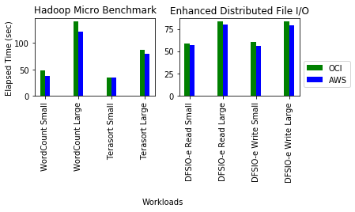
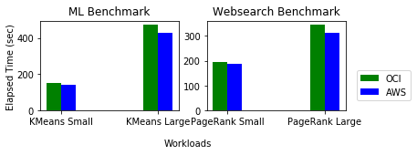
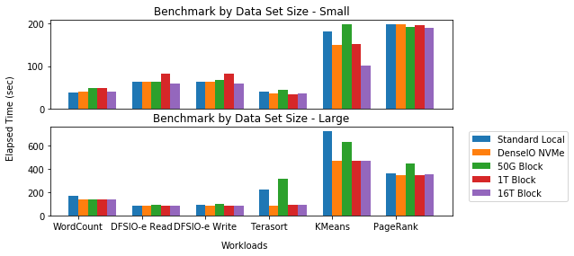

Big Data Benchmark: Running Big Data Workloads on Bare Metal Clouds, Oracle and Amazon
======================================================================================

Preprint: DOI: 10.13140/RG.2.2.12204.36486 `researchgate <https://www.researchgate.net/publication/325498880_Big_Data_Benchmarks_on_Bare_Metal_Cloud>`_

Bare Metal Comparison
---------------------

Report Data
^^^^^^^^^^^^

- `AWS <bench/aws.i3.metal/1t32000iops/hibench.report>`_
- `OCI <bench/oci.bm.standard2.52/16t/hibench.report>`_

Server
^^^^^^^

- 1 x OCI BM.Standard2.52
- 1 x AWS i3.metal

VM Image
^^^^^^^^

- Amazon Linux 2 AMI
- Oracle Linux 7.5 

Block Storage
^^^^^^^^^^^^^^

- OCI: 1TB with 25000IOPS
- AWS: 1TB with 32000IOPS

* mounted with xfs

HiBench 7.0
^^^^^^^^^^^

- Hadoop 2.7.5 + CDH using Docker with Centos 7 base image

  - ``docker pull lee212/hibench-docker-cdh``

- Hadoop 3.0.1 is under development

  - ``docker pull lee212/hadoop:3.0.1``

Data Size
"""""""""

- small
- large in `micro <https://github.com/intel-hadoop/HiBench/tree/master/conf/workloads/micro>`_

Storage Comparion
---------------------

Report Data
^^^^^^^^^^^^

- `local NVMe <bench/oci.bm.denseio2.52/local/hibench.report.2>`_
- `50g 3000IOPS <bench/oci.bm.denseio2.52/50g3000iops/hibench.report>`_
- `1T 25000IOPS <bench/oci.bm.standard2.52/1t/hibench.report>`_

Server
^^^^^^^

- 1 x OCI BM.Standard2.52
- 1 x OCI BM.DenseIO2.52

Storage Options
^^^^^^^^^^^^^^^

- local NVMe
- 50G block
- 1T and 16T block

* mounted with xfs

Hadoop configuration
--------------------

- `conf <docs/hadoop/conf>`_

